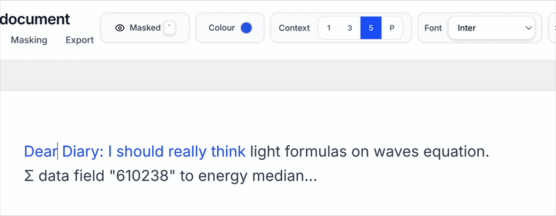
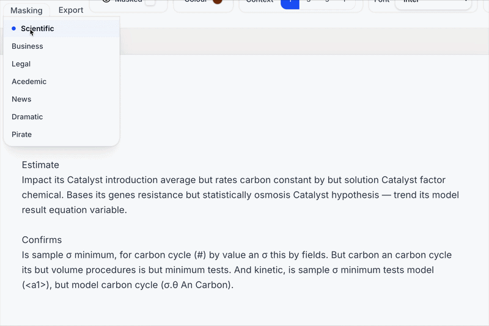

# Camo Note

## [Try it now → Camo Note](https://camonote.miladggg.com/editor)  
#### A fast and free demo is available on my site!

## Features

[Camo Note](https://camonote.miladggg.com/editor) is my web app solution to shoulder surfing.

### Text Masking

As you type in Camo Note, your words are masked so your page always looks like an innocent document to anyone glancing at your screen.

### Context Reveal

To keep your flow, words around your caret can reveal themselves in a small radius. You can tune the amount of context, or hold the backtick key (`) to temporarily reveal everything.

### Masking Styles

Masking styles control what onlookers see: scientific report, legal document, news article, and more. You stay readable to yourself while blending into any workspace.

